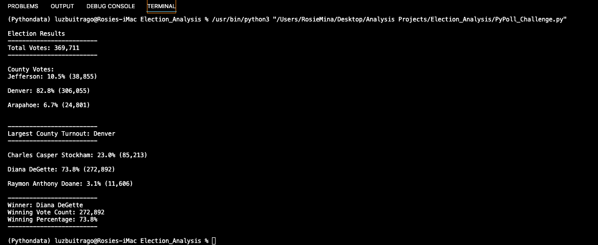

# Election_Analysis

## Purpose:

- The purpose of the analysis was to find the sum of votes for each candidate and county, along with that we also found that biggest turnouts and found the winner to the race by the popular vote. 

## Election Results
-How many votes were cast in this congressional election? (Please see picture below)
- Provide a breakdown of the number of votes and the percentage of total votes for each county in the precinct. (please see picture below)
- Which county had the largest number of votes? THe county with the largest turnout was Denver with 306K votes which was about 83% of total votes
- Provide a breakdown of the number of votes and the percentage of the total votes each candidate received. (please see picture below)
- Which candidate won the election, what was their vote count, and what was their percentage of the total votes? Diana DeGette was the winner with a total of 272,892 votes and 73.7% of the total votes.

## Summary

- The code we used to determine the election can be simply modified to be used in future elections. Since the code is already in place we would just have to create new dictionaries for the new candiates and update the counties to those that fit the election. If we organize each potential election into dictionaries of counties, cities, and states, in the future we would just have to update the candidates. The bulk of the workload can be front ended. 

- This same code can be used to find the winner to a chief of police in a town. Also school board elections. Instead of states or cities, the code would have dictionaries that have to do with sections of a town, age, and political stance. 
